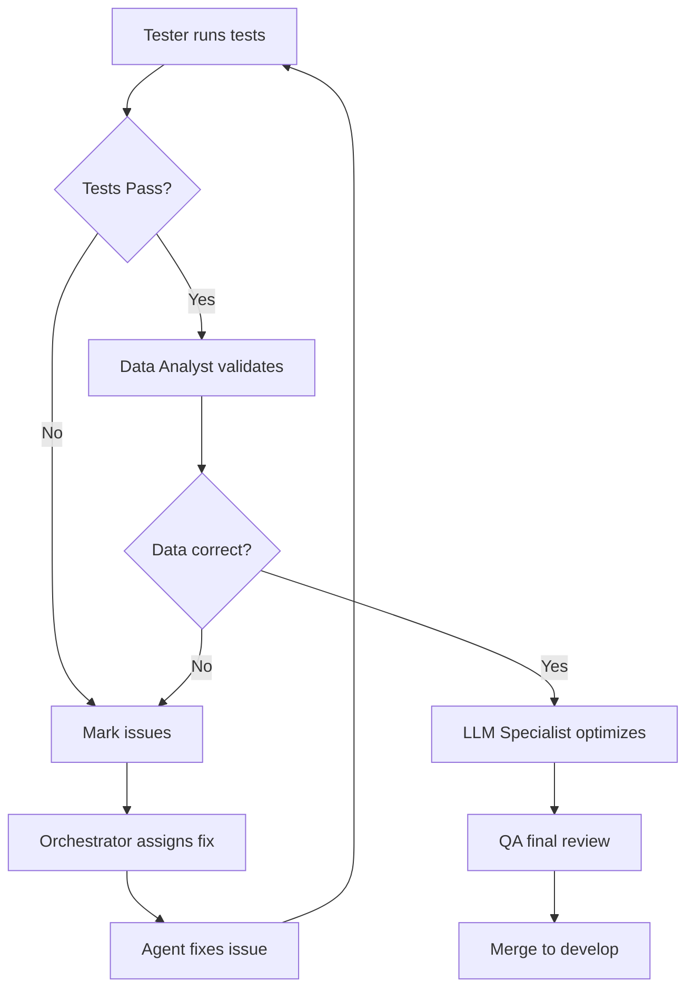

# CLAUDE.md - Master Orchestration Documentation

This file serves as the central command center for the multi-agent orchestration system managing the Wonder healthcare matching platform.

## ⚠️ CRITICAL CONFIGURATION - MUST READ FIRST

### Gateway Port Configuration
- **Gateway runs on port 5050** (NOT 5000)
- **UI Vite proxy must target**: `http://localhost:5050`
- **Default engine for chatbot**: `engine-basic` (most stable)

### Known Issues and Solutions

#### Field Mapping Issues (FIXED)
- **Problem**: Frontend sends `municipality` but gateway expects `city`
- **Solution**: Transform in `packages/ui/src/utils/api.ts:57`
- **Problem**: Frontend sends `specializations` but engines expect `servicesQuery`/`expertiseQuery`
- **Solution**: Map in api.ts before sending to gateway

#### City Matching Issues (FIXED)
- **Problem**: Data has "Tel Aviv-Yafo" but queries search for "Tel Aviv"
- **Solution**: Flexible substring matching in `packages/engine-basic/src/lib/basic.js:15-35`

#### Service Filtering Issues (FIXED)
- **Problem**: Basic engine expects singular `service` but gets array `servicesQuery`
- **Solution**: Check both services array and specialization in basic.js filter logic (lines 37-71)
- **Problem**: Services like Pediatrics, Day Night, Home Care weren't matching
- **Solution**: Added specific service mappings in basic.js (lines 49-54, 65-67)

#### Validation Issues (FIXED)
- **Problem**: topK limited to max 10, rejecting larger values
- **Solution**: Increased max topK to 100 in gateway validation (server.js:233)

## 🎯 Project Overview

**Project:** Wonder - Production-Grade Healthcare Matching Platform
**Goal:** Unified monorepo with natural language chatbot and multi-engine nurse matching
**Start Date:** 2025-09-09
**Target Completion:** 2025-09-23

## 🏗️ System Architecture

### Core Components
1. **Chatbot Interface**: Natural language query system for nurse availability
2. **Three Matching Engines**:
   - Azure GPT-5 (LLM-based semantic matching)
   - Basic Filter (Rule-based filtering)
   - Fuzzy Match (Weighted fuzzy string matching)
3. **Unified Data Layer**: Integration with nurses.csv from QuickList
4. **Production Gateway**: Orchestrates all engines with monitoring

## 🤖 Multi-Agent Orchestra

### Agent Roster and Responsibilities

| Agent | Branch | Status | Current Task | Last Update |
|-------|--------|--------|--------------|-------------|
| **Orchestrator** | main/develop | Active | Managing agent deployment | 2025-09-09 |
| **Backend Engineer** | feature/backend-refactor | Pending | Awaiting assignment | - |
| **Frontend Developer** | feature/ui-modernization | Pending | Awaiting assignment | - |
| **Data Analyst** | feature/data-validation | Pending | Awaiting assignment | - |
| **Tester** | feature/testing-suite | Pending | Awaiting assignment | - |
| **QA Agent** | feature/quality-assurance | Pending | Awaiting assignment | - |
| **LLM Specialist** | feature/llm-optimization | Pending | Awaiting assignment | - |
| **DevOps** | feature/infrastructure | Pending | Awaiting assignment | - |
| **Documentation** | feature/documentation | Pending | Awaiting assignment | - |

## 📋 Commands and Workflows

### Git Operations
```bash
# Check current branch status
git status

# Create new feature branch
git checkout -b feature/[agent-task]

# Commit with conventional commits
git add -A
git commit -m "feat(agent): Description"

# Push and create PR
git push origin feature/[agent-task]
```

### Testing Commands
```bash
# Run all tests
npm test

# Run specific engine tests
npm test -- --grep "engine-name"

# Run integration tests
npm run test:integration

# Run performance tests
npm run test:performance
```

### Development Commands
```bash
# Start gateway (MUST specify port 5050)
cd packages/gateway && PORT=5050 npm start

# Start with hot reload
npm run dev

# Build for production
npm run build

# Deploy to staging
npm run deploy:staging
```

## 🔄 Quality Loop Process



## 📊 Data Model

### Nurses Data Structure (from QuickList CSV)
```javascript
{
  nurse_id: string,
  gender: string,
  name: string,
  mobility: string,
  municipality: string,
  updated_at: datetime,
  status: string,
  is_active: boolean,
  is_profile_updated: boolean,
  is_onboarding_completed: boolean,
  is_approved: boolean,
  treatment_type: string
}
```

### Query Interface
```javascript
// Natural language query
"Who is available today at 3pm in Tel Aviv?"

// Parsed to structured query
{
  municipality: "Tel Aviv",
  date: "2025-09-09",
  time: "15:00",
  available: true
}
```

## 🚀 Deployment Strategy

### Environment Structure
- **Local**: Development and testing
- **Staging**: Integration testing with all agents
- **Production**: Final deployment after QA approval

### Branch Protection Rules
- `main`: Protected, requires 2 reviews
- `develop`: Protected, requires 1 review
- `production`: Protected, requires QA sign-off

## 📈 Progress Metrics

| Metric | Target | Current | Status |
|--------|--------|---------|--------|
| Code Coverage | 90% | 0% | 🔴 |
| Test Pass Rate | 100% | 0% | 🔴 |
| Documentation | 100% | 10% | 🔴 |
| Performance Score | 95/100 | 0/100 | 🔴 |
| Security Score | A | N/A | 🔴 |

## ⚠️ Critical Rules

1. **NO agent works without checking this file first**
2. **Every commit must update PRODUCTION_TRACKER.md**
3. **All PRs must reference this documentation**
4. **Test-Analyze-Fix loop is mandatory**
5. **No merge without full test coverage**
6. **Documentation is not optional**

## 🧪 Two-Agent Testing Orchestration

### Overview
Implemented bulletproof testing system with Playwright MCP and Edge browser for screenshot-based validation.

### Architecture
- **TestRunnerAgent**: Executes tests sequentially, captures screenshots
- **FixerValidatorAgent**: Analyzes failures, applies fixes, validates solutions

### Testing Workflow
1. TestRunner executes test
2. On error: stops immediately, passes to Fixer
3. Fixer analyzes error, applies fix
4. Fixer validates fix works
5. TestRunner continues from where it stopped

### Running Tests
```bash
# Run two-agent orchestrated tests
cd tests
node two-agent-orchestrated-tests.js

# Run Playwright-based tests
node playwright-orchestrated-tests.js
```

### Test Coverage
- ✅ Basic availability queries (Tel Aviv, Haifa, Beer Sheba)
- ✅ Hebrew language queries
- ✅ Time-based queries (today at 3pm)
- ✅ Service-specific queries (wound care)
- ❌ Jerusalem queries (no data in CSV)

## 🎯 Next Actions

1. ✅ Create CLAUDE.md (this file)
2. ✅ Fix chatbot 500 errors
3. ✅ Implement two-agent testing system
4. ✅ Update gateway port configuration
5. ⏳ Add Jerusalem test data
6. ⏳ Expand test coverage for edge cases

## 📝 Notes and Decisions

- **2025-09-09**: Project initiated, master documentation created
- **2025-09-09**: Fixed critical chatbot 500 errors - field mapping issues
- **2025-09-09**: Implemented two-agent testing orchestration system
- **2025-09-09**: Fixed gateway port configuration (5000 → 5050)
- Decided to use React for frontend (modern, component-based)
- Chose PostgreSQL over JSON for production data storage
- Will implement WebSocket for real-time updates

### Critical Fixes Applied
1. **api.ts:57-75**: Transform StructuredQuery to gateway format
2. **vite.config.ts:16**: Fixed proxy target port to 5050
3. **basic.js:152-171**: Fixed city filtering for partial matches
4. **basic.js:173-185**: Fixed service filtering to check arrays

## 🔗 Important Links

- **Main Repository**: /home/odedbe/wonder
- **Engines**:
  - Azure GPT: /home/odedbe/wonder/engine-azure-gpt5
  - Basic Filter: /home/odedbe/wonder/engine-basic
  - Fuzzy Match: /home/odedbe/wonder/engine-fuzzy
- **Gateway**: /home/odedbe/wonder/gateway
- **Data**: /home/odedbe/wonder/engine-*/sample_data/nurses.csv

---

**Last Updated**: 2025-09-09 12:00:00
**Updated By**: Claude Code - Fixed chatbot and testing
**Version**: 1.1.0